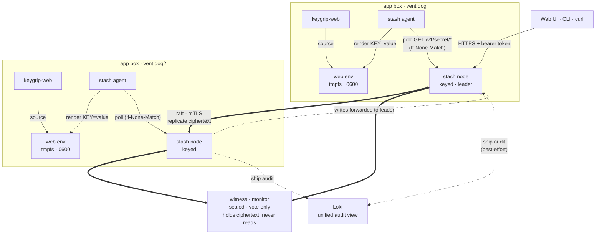
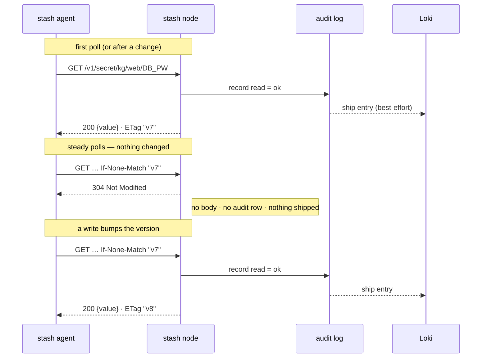

# stash

A lightweight, single-binary, highly-available secrets manager. The goal: HA
secret storage that is genuinely *easy* to stand up — no external database, no
Redis, no Kubernetes. One Go binary that does it all, replicating state with
embedded Raft.

> **Status: M1–M8 complete (dev roadmap done).** This is a hobby project and is
> **not production-ready**. Do not trust it with real secrets yet. (For the
> keygrip dev pair, SOPS stays authoritative until this is battle-tested.)

## Why

The self-hosted options are bulky (Infisical drags in Node + Postgres + Redis)
or operationally heavy (Vault/OpenBao's unseal story fights reboot self-heal).
On a small, capacity-constrained box pair you want something that:

- is **one static binary** with an embedded store (no DB to run/back up);
- is **HA** via embedded Raft, so losing a node doesn't lose the service;
- **auto-unseals** from a tiny bootstrap key on tmpfs, preserving 3am
  reboot-self-heal (no human, no external call);
- gives you **audit + revoke + versioning** — the things plain SOPS lacks
  (on the roadmap).

## Architecture

### The whole picture

Each app box runs its own local `stash` node *and* a `stash agent`. The agent
polls the local node and renders the secrets it may read into a tmpfs env file;
the app just sources that file. Reads are served locally; writes are forwarded to
the leader; a sealed witness provides the third Raft vote without ever being able
to read a secret. Each node keeps its own audit log and ships it (best-effort) to
Loki for one durable, queryable view across the cluster.



### Envelope encryption

```
unseal key (KEK)  ── lives only in memory / on tmpfs, never in the DB or log
      │  unwraps
      ▼
data key (DEK)    ── random, generated at bootstrap, replicated wrapped(KEK)
      │  encrypts
      ▼
secret values     ── XChaCha20-Poly1305, AAD = "secret:<path>" (binds value→path)
```

Encryption happens **once, on the leader**; the resulting ciphertext is what
gets replicated, so every replica holds byte-identical state. The Raft log and
snapshots only ever contain ciphertext plus the *wrapped* DEK.

### HA + the witness

```
   ┌──────────┐   raft   ┌──────────┐
   │  node 1  │◀────────▶│  node 2  │   both unsealed (KEK on tmpfs) → serve reads/writes
   │  voter   │          │  voter   │
   └────┬─────┘          └─────┬────┘
        └────────┬─────────────┘
            ┌────▼─────┐
            │ witness  │  voter for quorum; started WITHOUT a key →
            │ (sealed) │  replicates ciphertext, cannot read a secret
            └──────────┘
```

Raft needs an odd voter count; a 2-box pair gets a third vote from a **witness**
started with no `-unseal-key`. It participates in consensus and stores ciphertext
but is cryptographically unable to read plaintext.

Writes are accepted only on the leader — a follower transparently reverse-proxies
write requests to the current leader. Reads are served locally (a follower may be
slightly stale).

### Conditional reads & the audit log

Every node keeps its own hash-chained, append-only audit log. A read that
discloses a secret is recorded — which means a polling client (the agent,
keygrip-web) that re-fetches every key on a fixed interval would flood the log
with churn for data that never changed.

`stash` fixes that at the disclosure boundary, not by dropping read auditing: a
secret read carries a strong `ETag` (its current version), and the client
revalidates with `If-None-Match`. An unchanged secret comes back `304` — no body
on the wire, and **no audit row, because nothing was disclosed**. Only an actual
disclosure (first read, or after a write bumps the version) is recorded.

The same applies to the key listing (`GET /v1/secrets`): its `ETag` is the
visible key *set*, so a poll that finds no keys added or removed `304`s and isn't
audited either. With both, a steady `-auto` poll where nothing changed (one
listing + N reads) writes **zero** audit entries.



### Packages

| Package | Responsibility |
|---|---|
| `internal/crypto`  | AEAD seal/open + key generation (XChaCha20-Poly1305) |
| `internal/store`   | bbolt-backed encrypted KV; KEK→DEK envelope; raw ops + snapshot export/import |
| `internal/cluster` | Raft FSM + node lifecycle (bootstrap, join, leader-forwarding, witness) |
| `internal/server`  | HTTP/JSON API; forwards writes to the leader |
| `cmd/stash`        | CLI: `init`, `server` |

## Quickstart

### Single node

```sh
make build
./stash init -unseal-key-out ./unseal-key            # generate the cluster key
./stash server -data ./data -unseal-key ./unseal-key -bootstrap

curl -s -X PUT localhost:8200/v1/secret/kg/web/SECRET_KEY -d '{"value":"s3cr3t"}'
curl -s localhost:8200/v1/secret/kg/web/SECRET_KEY    # {"value":"s3cr3t"}
curl -s localhost:8200/v1/health                      # {"is_leader":true,"sealed":false,...}
```

### Three-node HA cluster — token pairing (no IPs to type)

```sh
# node 1 — bootstrap. Prints a join token (and a warning).
./stash init -unseal-key-out key
./stash server -unseal-key key -bootstrap
  → To add a node, run on the new box:
        stash join stash1.eyJjaWQiOi…

# node 2 — paste the token. Address is auto-detected.
./stash join stash1.eyJjaWQiOi…

# witness — keyless token => sealed quorum voter (replicates ciphertext, can't read)
./stash join stash1.eyJjaWQiOi… --no-key
#   or mint a dedicated keyless token elsewhere:  stash token --no-key
```

A new node self-detects the address peers will reach it at (by checking the
route to the leader), so you don't type IPs or ports. On the same host (demo),
pass `-listen`/`-raft-port` to avoid collisions; across real boxes the defaults
are fine. Restarting a node is just `stash server -data DIR -unseal-key key` —
it recovers its identity/addresses from `cluster.json`.

To ship a new build to the running cluster (build a static binary, rolling
restart, per-node specifics for the systemd + NixOS boxes), see
[docs/DEPLOY.md](docs/DEPLOY.md).

**The join token carries the unseal key by default** so it's a single value to
move. That makes the token as sensitive as the master key — prefer your tailnet,
don't paste it into shared logs, and use `--no-key` for witnesses or any posture
where the KEK should stay in SOPS. On join the key is written to a local `0600`
file so restart/self-heal still works.

In production the unseal key is the only thing you keep in SOPS, decrypted to
tmpfs at deploy. That's the entire residual SOPS surface.

## Identity & access

API requests authenticate with a bearer token (`Authorization: Bearer <token>`
or a `stash_token` cookie for the console). Each **identity** has policies:

```
policy = { prefix: "kg/web/", caps: ["read","write","delete"] }
```

A request is allowed if some policy's prefix matches the path and grants the
capability. `admin` identities bypass policies and may manage other identities.
`list` returns only the paths the caller can read.

- **Root token** — bootstrap mints an admin `root` identity and prints its token
  once. Use it to log into the console and to create scoped identities.
- **Tokens are hashed at rest** (sha256); only the holder ever has the plaintext,
  shown once at creation.
- **Open mode** — if no identities exist yet (e.g. a cluster upgraded from M4),
  the API is *open* (no auth) and logs a warning, so you're not locked out.
  Creating the first identity flips on enforcement.

```sh
# create a read-only CI identity scoped to kg/web/*
curl -H "Authorization: Bearer $ROOT" -X POST $API/v1/identities \
  -d '{"name":"ci","admin":false,"policies":[{"prefix":"kg/web/","caps":["read"]}]}'
# -> {"name":"ci","token":"stash-…"}   (shown once)
```

## Versioning

Every write keeps the previous values: the last `MaxVersions` (10) versions per
path are retained, each stamped with the time the leader applied it. Version
sequences are assigned by the FSM, so every replica derives the same history.

- `GET /v1/versions/<path>` lists versions (newest first).
- `GET /v1/secret/<path>?version=N` reads a specific version.
- **Restore** = read an old version and write it back (creating a new current
  version) — exposed as a button in the console's per-secret History view.

Deleting a secret also clears its version history.

## Audit log

Every secret read/write/delete/list and identity change is recorded in a
per-node, append-only, **hash-chained and Ed25519-signed** audit log (each entry
embeds the prior entry's hash, so any edit/insert/delete is detectable, and each
is signed by the node's persistent key so a rewritten entry can't be
re-chained without the key). Denied attempts are logged too, with the identity,
action, path, and result. The signing key lives at `<data>/audit.key`
(generated on first start); its public half can verify the log — or its Loki
copy — without trusting the node.

It's intentionally **per-node** — each node logs the operations it actually
served (reads are served locally, so only a per-node log captures them) — and
lives in its own `audit.db`, separate from the replicated store. View it at
`GET /v1/audit` (admin, paginated via `limit` + `before` cursor) or in the
console's Audit panel, which shows entries (with a Load-more button) and a
chain-integrity indicator.

**Shipping to Loki.** Because the log is per-node, a full view means querying
every node, and a node's local log dies with its disk. Point `stash server`/`join`
at a Loki push endpoint — `-audit-loki http://loki:3100` (or `$STASH_AUDIT_LOKI`)
— and each node streams its entries (labelled `job="stash-audit", node="…"`) to
Loki for one durable, queryable view across the cluster. It's **best-effort**: the
local hash-chained `audit.db` stays the source of truth, so a Loki outage just
pauses shipping — nothing blocks and no audited operation is lost.

**Trusted timestamps (anchoring).** Hash-chaining + signatures stop an *outsider*,
but a malicious key holder who also controls the clock could rewrite and re-sign
the whole log with fabricated times. Point a node at an RFC 3161 Time-Stamp
Authority — `-audit-tsa http://timestamp.digicert.com` (or `$STASH_AUDIT_TSA`),
with `-audit-anchor-interval` (default 1h) — and it periodically sends just the
**chain head hash** (never secret contents) to the TSA, storing the signed token.
Because the chain is hash-linked, anchoring the head proves every prior entry
existed *no later than* that timestamp; the cadence sets the backdating
resolution. Verify offline with `stash audit verify` (chain + signatures +
anchors against the TSA's root; system roots by default, or `-tsa-roots <pem>`).
See `AUDIT-TIMESTAMPING.md` for the full design, threat model, and what anchoring
does and doesn't defend against.

## Agent (render to file + self-heal)

`stash agent` renders secrets into a local file from a template and keeps a
**last-good cache**. If the cluster is briefly unreachable (e.g. a box rebooting
before the cluster is back), it re-serves the cache so the app still starts —
the reboot-self-heal property carried over from keygrip's ADR-0001.

```sh
cat > app.env.tmpl <<'EOF'
SECRET_KEY={{secret "kg/web/SECRET_KEY"}}
DATABASE_URL={{secret "kg/web/DATABASE_URL"}}
EOF

STASH_TOKEN=stash-… stash agent \
  -api http://10.0.0.1:8200 \
  -template app.env.tmpl \
  -out /run/keygrip/app.env \      # tmpfs
  -cache /var/lib/stash/app.env.last \  # persistent, survives reboot
  -interval 1m                     # omit for render-once
```

A failed render never writes a partial file; on fetch failure it copies the
cache to `-out` and exits 0 (logging a warning). With no cache and an
unreachable cluster, it fails loudly. For self-heal, put `-out` on tmpfs and
`-cache` on persistent disk.

**Picking up changes.** With `-interval`, the agent re-renders on that schedule
and rewrites `-out` **only when a value actually changed** (no churn otherwise).
Because most apps read their `.env` once at startup, rewriting the file isn't
enough — so `-on-change "<cmd>"` runs a command after a real change (e.g.
`systemctl reload keygrip-web`) to make the app pick up the new value. Use `-ca`
to trust a TLS cluster's CA.

## Web console

Open `http://<node>:8200/` in a browser. The console is a dependency-free
HTML/CSS/vanilla-JS app embedded in the binary (no framework, no CDN, no npm) —
it talks to the JSON API below. It shows cluster membership (leader/followers,
voter/witness, sealed state) and lets you add, reveal, copy, edit, and delete
secrets. A witness node shows `sealed` and refuses reveals.

Access control is **network-level** for now — front it with **Tailscale Serve**
(the GlitchTip/Grafana admin-plane pattern); in-app auth arrives with the
identity milestone. Don't expose the port to untrusted networks.

```
internal/ui/assets/{index.html,style.css,app.js}  →  go:embed  →  served at /
```

## API

| Method | Path | Body | Result |
|---|---|---|---|
| `GET`    | `/v1/health`         | — | `{"status","sealed","is_leader"}` |
| `GET`    | `/metrics`           | — | Prometheus gauges: `stash_up`, `stash_sealed`, `stash_is_leader`, `stash_raft_has_leader`, `stash_raft_voters`, `stash_raft_members` |
| `GET`    | `/v1/secrets`        | — | `{"keys":[...]}` |
| `GET`    | `/v1/secret/<path>`  | — | `{"value":"..."}` (optional `?version=N`) |
| `GET`    | `/v1/versions/<path>` | — | `{"versions":[{"seq","time"},…]}` |
| `PUT`    | `/v1/secret/<path>`  | `{"value":"..."}` | `204` (forwarded to leader) |
| `DELETE` | `/v1/secret/<path>`  | — | `204` (forwarded to leader) |
| `POST`   | `/v1/cluster/join`   | `{"node_id","raft_addr","http_addr","secret"}` | `200` (secret-gated) |
| `GET`    | `/v1/cluster/status` | — | `{"node_id","is_leader","sealed","leader_id","servers":[…]}` |
| `GET`    | `/v1/identities`     | — | `{"identities":[…]}` (admin) |
| `POST`   | `/v1/identities`     | `{"name","admin","policies":[…]}` | `{"name","token"}` (admin) |
| `DELETE` | `/v1/identities/{name}` | — | `204` (admin) |
| `GET`    | `/v1/audit?limit=N&before=SEQ` | — | `{"entries":[…],"verified":bool,"count":N}` (admin, paginated) |
| `GET`    | `/` and `/app.js`, `/style.css` | — | embedded web console |

All `/v1/secret*`, `/v1/secrets`, `/v1/cluster/status`, and `/v1/identities`
routes require a bearer token (unless the cluster is in open mode). `/v1/health`
and `/metrics` are always open (the latter exposes only role/seal/leader/voter
gauges — no secret material or addresses); `/v1/cluster/join` is gated by the join
secret instead.

`<path>` may contain slashes (`kg/web/SECRET_KEY`).

## Roadmap

UI is pulled forward deliberately — the friendly UI is the whole differentiator,
and each later milestone now *feeds* it (audit view, history/diff, login).

- [x] **M1 — single encrypted node**: bbolt + envelope encryption + auto-unseal, HTTP API.
- [x] **M2 — HA**: embedded `hashicorp/raft` (voters + sealed witness), leader-forwarding, bootstrap.
- [x] **M3 — easy join**: one-token pairing, auto address-detection, secret-gated join, restart from `cluster.json`.
- [x] **M4 — Web UI v1**: embedded console (dependency-free, tailnet-gated) — view/add/edit/delete secrets, cluster health.
- [x] **M5 — identity & access**: bearer-token identities (hashed at rest) + path-prefix ACLs; root token; UI login + Identities panel; open-mode for upgrades.
- [x] **M6 — audit**: per-node hash-chained append-only audit log (reads, writes, denials, identity changes); admin API + UI panel with chain-integrity check.
- [x] **M7 — versioning**: keep last N versions per path (replicated, pruned); read any version; UI History view with view + restore.
- [x] **M8 — agent**: `stash agent` renders secrets to a file from a template with a last-good cache (reboot-during-outage self-heal).
- [x] **inter-node mTLS**: stash-as-CA (in the join token), mutual-TLS Raft + API forwarding, HTTPS API (default on; `-no-tls` for dev).
- [x] **agent reload**: change-detection + `-on-change` hook so apps pick up rotated secrets.
- [ ] follow-ups: join-secret rotation (`stash token rotate`), Tailscale auto-discovery, ship audit log to Loki, persistent units (systemd/NixOS).

## Security notes (read before trusting it)

- Crypto uses only Go stdlib + `x/crypto` AEAD primitives — nothing hand-rolled.
- Identity tokens are stored only as sha256 hashes; plaintext is shown once.
- **TLS is on by default** (`-no-tls` to opt out for local dev). stash runs its
  own CA (in the join token); Raft + node-to-node API forwarding use mutual TLS,
  and the API is HTTPS. Browsers use TLS + bearer token (front with Tailscale
  Serve for a clean cert); the agent trusts the CA via `-ca`. Client-cert mTLS
  for end users is intentionally not required (bad browser UX).
- The unseal key never enters the Raft log. A keyed join token *does* carry it
  (by design, for one-value setup) — so the token is crown-jewel sensitive;
  `--no-key` avoids it. Join is gated by a per-cluster secret (constant-time
  compared), but that secret is currently long-lived — rotation is a follow-up.
- Transport between nodes (Raft + the HTTP API) is currently **unencrypted** —
  run it over a private network / tailnet. mTLS is future work.
- This has **not** been audited. Treat M1–M5 as a learning build.
```
